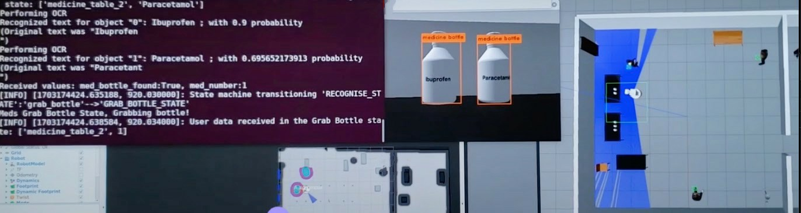
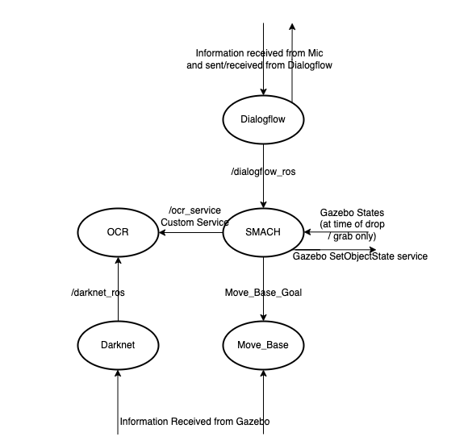
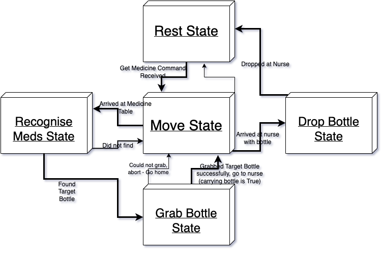

# 🤖 Medicine Retrieval: Robotics System with TIAGo

An intelligent Robotics System for Medicine Retrieval built modularly with ROS, combining Natural Language Processing, Robotic Navigation, and Computer Vision with OCR, to retrieve specific medicine bottles upon spoken command. This project demonstrates a complete system for autonomous service robots in healthcare-like settings: listening to and understanding spoken commands from a nurse, safely navigating to the medicine location, detecting medicine bottles and reading their labels through OCR, to recognise and deliver the bottle to the nurse. The system showcases AI components - NLP, Navigation, Vision with OCR - working seamlessly in state-driven control.

---

## 🦾 Features

This robotics project integrates natural speech understanding, robotic navigation, computer vision, and OCR into a cohesive system, highlighting end-to-end automation from detection to delivery. It is designed as both a technical showcase and a practical demonstration in simulation of how service robots could be used to handle real-world healthcare tasks. This project was informed by thorough research into existing robotic systems and technologies, incorporating these to create a unique medicine retrieval system.

- **Speech Understanding** – Listens to & understands spoken commands, including which medicine to retrieve
- **Navigation & Delivery** – Navigates autonomously to the medicine table; then returns the found medicine to the requesting nurse and places it at a designated table
- **Medicine Bottle Detection** – Uses Darknet YOLOv3 for real-time recognition of medicine bottles within the environment
- **OCR Label Reading** – Performs text extraction and optical character recognition on bottle labels to correctly identify specific medicines (e.g. Paracetamol, Ibuprofen), matching results using Levenshtein distance
- **State-Machine Control** – Clearly transitions between system states (such as `Move_State → Recognise_State → Grab_Bottle_State`) for structured execution
- **Multi-Step Task Execution** – Detects & searches across multiple tables if the requested medicine is not found initially, ensuring robustness in the task
- **Gazebo Integration** – Provides a realistic simulated hospital environment for testing speech, navigation, vision & OCR, and grasping
- **ROS Architecture & Design** - Follows recommended ROS design & architecture principles, modularly dividing concerns with nodes, topics, and actions/services
- **Terminal & Debug Outputs** – Logs OCR results w/ confidence probabilities and state transitions for transparency and easy debugging

<ins>**📸 Example Snapshot of OCR Performance & State Transition in Action**</ins>

  

*This figure shows an example snapshot of the system, just as it has performed OCR on medicine bottles and has correctly identified 'Paracetamol', which was the requested medicine.*

- The **Darknet output (centre)** shows that the Ibuprofen and Paracetamol bottles had both been correctly detected & recognised as Medicine Bottles
- The **Terminal output (left)** shows that the labels on both bottles were OCR'd, and correctly text-matched with medicines known to the robot, along with their confidence probabilities
- The **Terminal** further shows the state now transitioning from the Recognise_State → Grab_bottle_state, in which the 'bottle 1' - which corresponds to the 2nd bottle on the table (since computer counting starts from 0) - should be grabbed
- The **Gazebo screen (right)** displays the scene, and what has happened so far:
    - upon spoken command, the robot autonomously navigated to the first table, and detected/recognised the medicine bottles and OCR'd the labels, but did not find Paracetamol (which is expected behaviour for this case)
    - after not finding it on the first table, it navigated and recognised & OCR'd the bottles/labels on the 2nd table, where it has just performed OCR and text matching to correctly identify Paracetamol, and is now preparing grasp it
- The following behaviour is, having grabbed the bottle, the robot navigates back to the nurse who requested this, and drops it off at the table near the nurse

---

## 🛠 Technology Stack

- **ROS Melodic** (Robot Operating System): Robotics middleware & framework
- **Python (w/ Rospy)**: Primary development language for logic
- **C++ (w/ Roscpp)**: Additional logic (mostly in Darknet)
 
- **Dialogflow** (Google): Natural Language Understanding
- **OCR.Space**: Optical Character Recognition
- **YOLOv3**: Image detection & recognition
- **SMACH**: State-Machine management

- **ROS Packages**:
  - **ROS Navigation Stack**: Robot navigation
  - **Dialogflow_Ros**: Google Dialogflow integration
  - **Darknet_Ros**: YOLOv3 Image recognition integration

- **Gazebo**: Simulation
- **TIAGo Robot** (PAL Robotics): Robot

- **ROS Tools**: Roscore, RViz, logging/debugging, Ros Wiki
- **ROS Design & Architecture**: Nodes, topics, actions/services
- **Apptainer (formerly Singularity)**: Container
- **Git & GitHub**: Version control
- **LaTeX**: Documentation

---

## ⚡ Technical Highlights  

- **Designed & Implemented a Modular ROS System**
  - Built a full robotic system using **ROS Melodic**, integrating nodes for speech, navigation, computer vision, OCR, with state-machine task management
  - Applied good ROS design & architecture principles: modular separation of **nodes, topics**, and **services/actions**  

- **Custom-Built OCR Node (Core Unique Functionality)**
  - Developed a new OCR node in Python (w/ Rospy), leveraging **OCR.Space API** for medicine label recognition
  - Implemented robust string-matching with **Levenshtein distance algorithm**, regulating & handling noisy OCR outputs
  - Integrated OCR with natural speech understanding, navigation, and object detection & recognition to achieve end-to-end **autonomous medicine retrieval**

- **State Machine (SMACH) for Task-Level Control**
  - Implemented a **state machine** from scratch using **SMACH_ros**, to effectively manage system states
  - Orchestrated informed transitions between idle (ready for speech command), navigation, and recognition states, ensuring smooth system behaviour
  - Designed for extensibility and failure handling (recovery in case of failure, return-to-home), and continuous readiness for spoken commands

- **Integration of AI & Robotics Frameworks**
  - **Natural Language Understanding & Processing**: Integrated Google's **Dialogflow** for robust intent/entity recognition from spoken commands into the mic
  - **Computer Vision**: Adapted **Darknet_ros** with **YOLOv3**, trained for medicine bottle detection & recognition
  - **Autonomous Navigation**: Utilised the **ROS Navigation Stack** for path planning and obstacle avoidance, ensuring safe autonomous navigation

- **Simulation (Gazebo) & Testing**
  - Conducted end-to-end system testing in **Gazebo**, in addition to individual component testing & integration testing
  - Utilised available **ROS tools** (roscore, terminal error logs, roslogs, RViz, rqt) for iterative development and troubleshooting

- **Research & Documentation**
  - Conducted thorough research into existing systems & (robotic) technologies to develop a unique system, integrating new ideas & development with existing technologies
  - Produced full technical documentation: architecture diagrams, design rationale, and implementation details
  - Formal dissertation written in **LaTeX**, including motivation for development, design details, requirements specification, implementation delve, evaluation of system performance

---

## 🔒 Public Repository Disclaimer
This robotics system was developed as an individual project, with Abs (me) being the sole author of my own package, and having modified & used other public packages as per licenses. Details may have been limited for privacy. This public repository is intended to be an educational demonstration and showcase the final system and how it performs in simulation etc, and is not intended for commercial use.

✨ Sole Author: Abs (me)

Public packages used:
  - Ros_navigation (*https://wiki.ros.org/navigation*)
  - Darknet_ros (*https://wiki.ros.org/darknet_ros*)
  - Dialogflow_ros (*https://wiki.ros.org/dialogflow_ros*)
  - SMACH (*https://wiki.ros.org/smach*)

---

## 🏗️ Architecture & Design

The application follows the supported ROS architecture, where logic/concerns and communication are separated into 3 sections:
- **Nodes**: Logic for individual components (each node contains its relevant processes)
- **Topics**: Communication channels which use *msgs* to exchange information between nodes
- **Services/Actions**: Direct Node interactions between client and server nodes

  

The system is composed of five primary ROS nodes:

- Move_base (adapted from move_base ROS package)
  - Provides path planning & safe robot navigation
  - Uses the established ROS_navigation stack

- Dialogflow (adapted from dialogflow_ros package)
  - Handles natural language speech input/output from/to the nurse
  - Integrates w/ Google's Dialogflow, using a custom-built bot
    - Custom bot designed to recognise specific intents & entities

- Darknet (adapted from Darknet_ros package)
  - Computer Vision: Performs object detection & recognition with Yolov3
    - Trained to detect medicine bottles

- **OCR** (implemented from scratch)
  - Custom-built node using OCR.space service for reading medicine labels
  - Combines behaviours of speech, navigation, object-detection/recognition, to culminate in retrieving the requested medicine
  - Uses Levenshtein distance algorithm for robust text matching

- SMACH (implemented by myself using SMACH_ros library)
  - Provides task-level architecture to manage state transitions  
  - Fully implemented by me to coordinate navigation, vision, and speech nodes.
 
These nodes all communicate via topics, listening and broadcasting the relevant information. The custom-built OCR_service activates the OCR node, which *reads* (with OCR) the text, and matches it using the Levenshtein distance algorithm implemented for string matching.

*The OCR node was entirely developed by myself and is the focus of this system, combining all information gathered from Natural Speech Understanding, Navigation, and Image recognition to use OCR technology to culminate in retrieving a specific medicine bottle. The State Machine behaviour was also implemented from scratch using SMACH_ros (see below for details of the state machine). The Dialogflow, Darknet, and Move_Base nodes have been adapted and extended from existing public ROS packages.*

## State Machine - ROS

At the core of this system is SMACH (State-Machine), which is used to create task-level architecture to enable smooth running of complex behaviour through a state machine. In this system, SMACH essentially helps in controlling which state the robot is currently in, allowing the correct behaviour to be activated: it enables rules in order to progress through various states to create a smoothly flowing robotics system.

The simplified diagram below shows an example of what a typical state flow of this system looks like. There are 5 states the robot can be in:
 - Rest: idle, waiting for spoken command
 - Move: Navigation activated
 - Recognise_Meds: image recognition + OCR to recognise specific medicine bottles
 - Grab/Drop Bottle: [*manipulation has not been implemented*] grabbing & dropping happens through code at this point

Based on the information gathered and actions successfully completed (or not), the state conditionally transitions: relevant information is passed through to the new state, using which it can perform its task.

  

In this diagram, the state flow moves counter-clockwise:
- from **Rest** → **Move** (location & which medicine bottle to pick up gathered through natural speech understanding);
- once at the location → **Recognise** (bottle to find passed from previous state);
- → **Grab** (identified bottle) → **Move** (back to original nurse - info passed all the way through)
- → **Drop** (bottle by the nurse)

The robot then cycles back into the Rest state, awaiting further commands.

*There are other transitions possible which have been omitted for clarity. For example, if a task fails, then the mission would be aborted and the robot would return to home position and into rest state*

---

## 👨‍💻 Potential Future Work & Extensions
This system completes the task of successful autonomous medicine retrieval: however, it is designed such that it is open to extensions and improvements. Some potential ideas to explore further, in order to provide functional & non-functional improvements & extensions:

- **Navigation**:
  - Speed reduction when humans detected for safer navigation (Darknet is already implemented such that detection is continuous, and trained to detect people)
  - Alternatively, lighter processing: Darknet's ongoing running uses continuous processing power, and could potentially be activated only when near relevant locations

- **Manipulation**:
  - Grasp and Drop bottles from/at correct locations with the robot's arm through implementation of manipulation

- **Variations of Cases**:
  - Mostly concerning the Dialogflow bot, more entities & corresponding intents can very simply be added in this extendable programming of the Dialogflow bot

- **Additional Tasks & System Integration**:
  - Can integrate with already existing systems to create a more complete robot, or can similarly add new tasks to this, leveraging the modular system design & architecture

- **Real-life Robot Testing**:
  - Beyond simulation in Gazebo, testing can be performed using an actual TIAGo robot in a suitable environment

---

## 🚀 Downloading & Running the Robotics System
If you are interested in running the system, please contact me directly. You can also reach out if you would like to see the full system documentation presented in my report.

- Prerequisites to run:
  - Linux (natively installed)
  - Apptainer (formerly Singularity)
